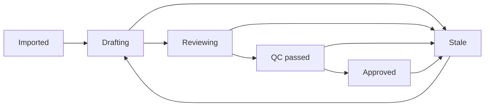
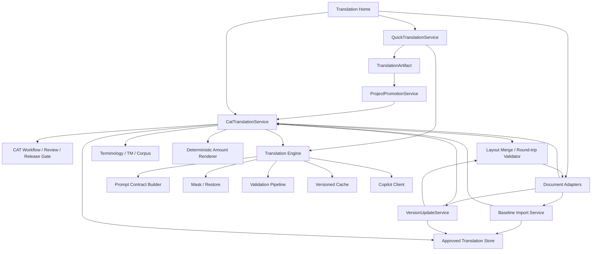

# YakuLingo CAT 翻訳 目標設計

作成日: 2026-08-09

対象: V91.61 以降
状態: 統合構想書（実装仕様ではない。Horizonごとのゲートを通過した範囲だけ実装対象）

## 0. 独立再レビュー後の設計決定

2026-08-09、利用者・業務、アーキテクチャ・実現性、品質・安全の三観点で本書全体を独立再レビューした。三者の共通結論は、中心原則は妥当だが、CAT再構築、翻訳資産管理、文書版管理、Office体裁マージ、組織承認を一つの実装目標に束ねるべきではない、である。

本書の機能を次の Horizon に分ける。

| Horizon | 実装対象 | 含めないもの |
| --- | --- | --- |
| **H1: CAT基盤再構築** | Quick/CAT境界、安全送信口、CAT専用翻訳、状態・QC・永続化、Excel維持、旧ルート削除 | Word、版間再利用、組織承認、完成ファイル保証 |
| **H2: 内容の版間再利用** | 直近1組の日英基準版、完全一致再利用、厳格な数値更新、翻訳一覧 | 複数年一括、自動最小改稿、完成DOCX |
| **H3: 限定文書対応** | Word本文・見出し・通常表の取込、能力inventory、翻訳一覧、構造同一fast pathの実証 | 汎用体裁3-wayマージ |
| **Research: 体裁マージ** | 型付きLayoutDiff、描画検証、能力プロファイル拡張 | 成功を前提にしない |

後続Horizonは前段ゲート不合格なら開始しない。特に汎用的なWord/Excel体裁3-wayマージは研究課題とし、実資料で人手より安全・短時間であることを証明するまで製品ロードマップへ確約しない。

再レビューで確定したP0修正:

1. Quick の利用者表示は「標準訳案（AI訳・未確認）」とし、「完成訳」と呼ばない。
2. `ProtectedPayload` はマスク実施を証明するだけで、本文の機密性を保証しない。別の外部送信可否ゲートを設ける。
3. 既存文書の真正性、公表・内部承認、日英文書対、segment alignment、翻訳品質、利用可能範囲を別々に検証する。
4. `inherited_approved` は採用しない。前版再利用は由来 `carried_forward` であり、現版の確認・QC・承認を通す。
5. core blocker は権限で上書きできない。
6. `controlled_release` は認証・役割・取消・署名が成立するまで有効化しない。ローカルアプリでは `reviewed` / `locally_attested` までとする。
7. 成果物可否は一つの `Exportable` ではなく、確認済み訳文一覧、DRAFT作業ファイル、体裁検証済み文書ごとに計算する。
8. DRAFT作業ファイルは構造round-tripが安全な能力範囲内だけで出せる。構造破損の可能性があれば訳文一覧だけを出す。
9. 完成ファイルは形式名ではなく、版付き能力プロファイルに文書inventoryが100%収まる場合だけ名乗る。
10. 初年度の標準導線は直近1組の日英取込とし、複数年一括取込は後段の管理機能へ延期する。

本節と後続詳細が矛盾する場合、本節を優先する。H1の具体設計は別紙 `_docs/CAT翻訳_Horizon1_実装可能な目標設計_2026-08-09.md` を正とする。

## 1. 結論

YakuLingo の入口は一つにする。利用者はまずテキストを貼って翻訳し、必要になった時だけ「保存して1文ずつ仕上げる」へ進む。Word・Excel の新規作業と前回作業の再開には、同じホームから直接入れる近道を置く。

内部の作業ライフサイクルは、次の二つに分けたままにする。

1. **一時翻訳（Quick）**: 一時的なテキストを、標準訳案（AI訳・未確認）として返す。保存、承認、TM 登録、外部 release は行わない。
2. **翻訳作業（CAT project）**: 文・段落・セル単位で保存、修正、確認、品質検査、承認、文書への書戻しを行う。

したがって方針は、**UI は連続させ、状態とユースケースは統合しない**である。二つのトップレベル翻訳タブも、全翻訳を暗黙にプロジェクト化する完全統合も採用しない。

廃止済みの「ファイル翻訳」は、画面だけでなく API・ジョブ・ドメイン名・依存関係からも削除する。CAT が旧ファイル翻訳の内部関数 `Invoke-YakuFileTranslationItems` を直接呼ぶ構造は、移行途中の実装として解消する。

内部資料用と外部資料用は、別々の翻訳機能にも品質段階にもしない。**同じ CAT の翻訳・再利用・QC 基盤を使い、スタイル、参照範囲、保証、金額表記、配布範囲だけを独立したポリシー軸にする。** 安全な組合せはプリセットで提示するが、一つの `internal/external` または `FULL/BRIEF` フラグへ束ねない。

ファイル出力には厳格な製品境界を置く。**本文だけでなく、前版日本語から現版日本語への構造・体裁差分を前版英語へ正しく反映し、round-trip 検証に合格できる場合だけ「完成ファイル」を出力する。** 体裁を保証できない形式・要素・文書では完成ファイルを生成せず、翻訳結果と対応表だけを提供する。部分対応のファイルを完成品として扱わない。

導入初年度も既存資産を使えるよう、アプリ外で公表・承認された過去の日英文書を、出典・承認・対応関係の検証付きで初期基準版へ取り込む。アプリ利用開始日を翻訳資産の開始日にしない。

## 2. この設計で解く問題

### 2.1 製品とコードの不一致

- UI ではファイル翻訳を廃止しているが、`/api/translate-file`、旧 JavaScript、ファイル翻訳ジョブが残っている。
- CAT の中核翻訳が `FileTranslation.ps1` の内部関数へ依存しており、廃止対象と再利用対象の境界がない。
- 旧ファイル翻訳のプロンプトは日英を常に BRIEF として生成するため、CAT の「省略のない標準訳」と用途が一致しない。
- 文書入出力が Excel に特化しており、外部公表資料で重要な DOCX の構造保持・書戻し経路がない。
- 日英2文書のアライメントはあるが、前版日本語・前版承認英語・現版日本語を使って内部・外部資料を差分更新する3-wayワークフローがない。
- 本文差分と構造・体裁差分を分けて追跡し、前版英語へ体裁変更だけを投影する契約と検証がない。

### 2.2 出力目的の混線

- 現状の「FULL／BRIEF」は、利用者の用途、文章の長さ、用語、金額表記を一つの名前でまとめすぎている。
- 外部公表資料に必要な完全な英文と、社内表・スライドに必要な省スペース英文を、同じ生成規則で扱えない。
- 金額表記 `oku` と `billion/million` の切替は設定の痕跡だけがあり、安全な桁変換が未実装である。

### 2.3 確認と公開可否の混線

- 現行 CAT の `Confirmed` は、手編集または確認操作を表すが、数値・固有名詞・未訳・用語を検査済みという意味ではない。
- プレースホルダー不一致を警告だけで翻訳マップやキャッシュへ入れ得る。
- Excel 出力は全行の確認や品質検査を必須にせず、未訳箇所を原文のまま出力し得る。
- `Confirmed` の訳をコーパスへ保存する際、数値確認済みとして扱う経路がある。

## 3. 設計原則

優先順位は次の順とする。下位の目的のために上位を破ってはならない。

1. **機密保護**: 文書分類と組織ポリシーで外部送信の可否を先に決め、許可された場合にも数値・固有名詞をマスキングする。
2. **事実保全**: 数値、符号、単位、期間、固有名詞、係り受け、文書構造を変えない。
3. **用途適合**: 外部公表または内部業務の用途に合う英語へ整える。
4. **一貫性**: 用語、表記、翻訳メモリ、コーパスを統制する。
5. **簡潔性**: 内容を落とさない範囲で短くする。

追加原則:

- `ProtectedPayload` はマスク処理済みであることだけを表す。未公表の施策、業績予想、理由、取引関係等の意味内容や、ファイル名・文書プロパティ・コメント等のメタデータは保護済みとみなさない。
- `ExternalSendGate` は文書分類、組織の許可、provider/tenant、学習利用、保持期間、処理地域、メタデータ送信範囲を評価する。不許可または不明ならローカル処理だけとし、権限による上書きを認めない。

- LLM に桁変換、公開可否判定、状態遷移を任せない。
- 承認済み日本語が同一なら、互換な承認済み英語をローカルで再利用し、LLMへ送らない。
- 原文が変わった場合も、前版承認英語を基準に変更部分だけを更新する。
- 内部／外部を翻訳品質の上下にせず、すべての保存型文書に同じ安全・事実保全の下限を適用する。
- 省略のない標準訳を正本とし、短縮訳は正本から派生させる。
- 人の操作、機械検査、公開承認を別々に記録する。
- キャッシュ命中は品質承認を意味しない。
- Word・Excel は入力・出力アダプターであり、翻訳規則や承認状態の所有者ではない。
- 設定を増やさず、プロジェクト作成時は目的に合う安全なプリセットを一つ選び、詳細ポリシーは必要な場合だけ見せる。

## 4. 利用者に見せるモデル

ホームの主役はテキスト欄と「翻訳する」である。副導線として「文書を開いて仕上げる」と「前回の作業を続ける」を置く。利用者に翻訳前のモード選択を求めず、主要 UI に `CAT`、`FULL`、`BRIEF` を表示しない。

```text
ホーム
├─ テキストを貼る → 翻訳結果
│                    ├─ コピー
│                    ├─ 省スペースにする
│                    └─ 保存して1文ずつ仕上げる → 翻訳作業
├─ Word・Excelを開いて仕上げる ─────────┘
└─ 前回の作業を続ける ─────────────────┘
```

### 4.1 すぐ訳す

- 入力: テキスト、翻訳方向。
- 主出力: 省略のない標準訳案（AI訳・未確認）を一つ。
- 任意操作: 「枠に入らないので短くする」。標準訳を入力にして短縮し、事実差分検査を通す。
- 保存型文書の詳細ポリシーは表示しない。短時間の一時利用に、プロジェクト設定を持ち込まない。
- 「保存して1文ずつ仕上げる」を押すまで、プロジェクトファイルと TM を作らない。
- blocker のある結果は、警告を添えてコピー可能にせず、コピー自体を無効にする。
- 翻訳作業へ進む場合は、原文、標準訳、方向、表記、契約版を新規プロジェクトの未承認案として渡す。

### 4.2 翻訳作業（内部名 CAT project）

「内部／外部」を翻訳品質の段階にしない。保存型の資料はすべて、同じ機密保護、事実保全、数値・固有名詞 QC、レビュー状態を使う。マネジメント会議・取締役会向け内部資料にも、将来の `controlled_release` と同等の厳格な検査・承認要件を適用できる。ただし認証・役割・取消・署名が成立するまでは、アプリ内表示を `reviewed` / `locally_attested` に限定する。

違いは独立したポリシー軸として持つ。

| 軸 | 例 | 決めるもの |
| --- | --- | --- |
| `style_profile` | `formal_complete` / `management_compact` | 完全文、略語、文章の密度 |
| `reference_scope` | `public_only` / `approved_internal` | 参照・再利用してよい用語、TM、過去文書 |
| `assurance_policy` | `reviewed` / `locally_attested` / 将来の `release_approved` | 必須レビュー、文書承認、出力ゲート、manifest |
| `amount_policy` | `public_yen` / `oku` | コード側の金額表示 |
| `distribution_scope` | `internal` / `external` | 保存・配布・監査上の境界 |

利用者へ多数の設定を並べず、次のような安全なプリセットを提示し、必要な場合だけ詳細を見せる。

| プリセット | スタイル | 参照範囲 | 保証 |
| --- | --- | --- | --- |
| 対外公表 | 原則 `formal_complete` | 検証済み公表・承認資産 | 現段階 `locally_attested`。外部署名後のみ `release_approved` |
| 取締役会・マネジメント | `formal_complete` または確認済み短縮 | 検証済み内部資産 | 現段階 `locally_attested` |
| 内部作業 | `formal_complete` または `management_compact` | 承認済み内部資産 | `reviewed`。作業ドラフトは明示 |

各セグメントまたは出力列には次の表現を持てる。

| 表現 | 意味 |
| --- | --- |
| `complete` | 正本。文として完結し、事実と論理関係を省略しない |
| `compact` | 正本から作る派生版。承認済み略語と構文圧縮を使う |

配布先にかかわらず正本は `complete` とする。セル幅などの必要がある箇所だけ `compact` を生成する。対外資料でも表や図の狭い枠には省スペース版を使え、内部資料でも本文や取締役会資料には完全な英文を使う。短縮版が正本を上書きしてはならない。`compact` は独立した派生成果物として、正本参照、独自のQC・レビュー・承認・失効状態を持つ。正本の承認を短縮版へ自動継承しない。

金額表記も独立して保存する。ポリシーは安全な既定値と許可範囲を示すが、表記変更のために再翻訳しない。現在のアプリは最終的な PDF、HTML、XBRL 開示物を生成しないため、画面では「公表物が完成する」ではなく「対外資料向けの英訳案を仕上げる」と説明する。

### 4.3 一時翻訳から翻訳作業への昇格

昇格は画面内の状態共有ではなく、Quick の `TranslationArtifact` から CAT project をトランザクションとして新規作成する操作である。

- 昇格前に「この先はローカルへ保存され、確定した訳だけが次回の候補になり得る」と説明する。
- ブラウザーが原文と訳文を再構成せず、サーバーが発行した artifact ID を渡す。
- 原文と完成訳の全文を失わず、追加の Copilot 呼出しを行わない。
- 文対応が不確実な箇所は未確認とし、対応不能でも完成訳全文を参照訳として保持する。
- 全セグメントを未承認、QC 未実施から開始する。
- 昇格に失敗した場合は Quick の結果を残す。
- Word・Excel は Quick を経由せず、最初から永続プロジェクトを作る。

### 4.4 前版の承認済み英語から更新する

保存型文書の入口では、内部・外部を問わず次の二つを分ける。

- **新規に翻訳する**: 現版日本語を基に英語を新規作成する。
- **前版の英語から更新する**: 前年度・前四半期等の日本語、対応する承認済み英語、現版日本語の三文書を取り込む。

後者は前版英語を単なる参考例にせず、承認済みの正本として扱う。外部資料では公表済み英語、内部資料では承認済みの前回提出版を使う。

```text
前版日本語 ───── bilingual alignment ── 前版承認済み英語
      │                                      │
      └── monolingual version diff ── 現版日本語
                                             │
                                      現版英語の更新案
```

基本動作:

1. 前版日本語と前版英語を対応付ける。
2. 前版日本語と現版日本語を対応付け、変更を分類する。
3. 無変更箇所は前版英語を一字も変えず再利用する。
4. 数値だけの変更は、可能な範囲でローカルの型付き数値更新を行う。
5. 文言変更は、前版日本語、前版英語、現版日本語、構造化した差分を使って最小限だけ改稿する。
6. 追加箇所は新規翻訳し、削除箇所は対応する前版英語を削除する。
7. 移動は再翻訳せず、前版英語を対応先へ移す。
8. 分割・結合・対応不明は自動確定せず、人の確認対象にする。

画面では、前版日本語、現版日本語、前版英語、現版英語を比較できるようにする。通常は変更箇所だけを表示し、「前版英語をそのまま使用」「数値更新」「改稿」「新規」「削除」「対応要確認」を区別する。

### 4.5 導入初年度の基準版取込

初回利用時は次の入口を用意する。

- **過去の日英資料を取り込んで始める**: 前年度・前四半期等の日本語と英語を初期基準版にする。
- **新規翻訳から始める**: 利用可能な英語版がない場合だけ全文翻訳する。

既存英語の由来を記録する。ただし、由来だけを信頼度や承認状態として扱わない。

| 由来 | 例 | 初期扱い |
| --- | --- | --- |
| `imported_public_release` | 会社サイト等で公表済みの日英資料 | 参照候補。公表実績だけでは自動再利用・承認継承しない |
| `imported_internal_approved` | 取締役会・会議提出済み、責任者承認済み | 参照候補。承認者・版・用途の証跡を別に検証する |
| `imported_reference_only` | 担当者の手元訳、承認不明の過去訳 | 候補表示のみ。自動再利用しない |
| `native_approved` | 本アプリでQC・文書承認済み | 現行ポリシー・取消状態を確認後に再利用候補にできる |

各取込資産は、由来と独立して次を記録・判定する。

- 文書の真正性と版の同一性
- 日英文書対の対応関係
- segment alignment の確認状態
- 翻訳品質と現行 QC への適合
- 承認者、承認範囲、承認時点、取消状態
- 現プロジェクトの用途・スタイル・用語・配布ポリシーとの互換性

六つのうち必要な検証が欠ける資産は `reference_only` 相当とし、自動採用、プロンプトへの暗黙注入、TM・承認済み資産への昇格を行わない。

取込処理は、過去日本語と過去英語を文書構造込みでアライメントし、数値、固有名詞、見出し、表構造、対象期間を検査する。高信頼の対応は基準版候補にし、分割・結合・欠落・意訳等で曖昧な箇所だけ人に確認させる。文書全体が公表・承認済みでも、誤ったsegment対応を自動承認しない。

標準導線では直近1組の日英資料を取り込み、利用者が確認した資料名、期間、版順序から `document_family_id` と version lineage を作る。原本ハッシュ、出典、承認根拠、取込日時、アライメント版を保存する。複数年・複数四半期の一括取込と自動系列推定は、単一組の安全性・有用性を実証した後の管理機能とする。

過去の日英対が存在する限り、導入初年度でも現版全文を再翻訳しない。全文翻訳が必要なのは、利用可能な過去英語がない部分、対応不能部分、または信頼できない参考訳しかない部分に限る。

## 5. 状態モデル

一つの `Confirmed` を廃止し、少なくとも次の状態を分離する。

### 5.1 Quick 状態

```text
idle -> protected -> generating -> qc_passed_draft -> promoted_to_cat
                                   -> qc_blocked   -> retry | discard
```

Quick の `qc_passed_draft` は未レビューであり、承認や release を意味しない。コピーは状態ではなく監査可能なイベントとする。`qc_blocked` はコピー不可とする。一時 artifact は再起動または明示した TTL で削除する。

### 5.2 CAT セグメント状態

| 状態 | 意味 |
| --- | --- |
| `empty` | 未翻訳 |
| `machine_draft` | 機械翻訳済み、未確認 |
| `human_edited` | 人が編集したが、品質検査・承認前 |
| `reviewed` | 人が原文対訳を確認した |
| `approved` | 必須の機械検査に合格し、承認者が確定した |
| `stale` | 原文、ポリシー、用語、正本の変更で再確認が必要 |

手編集だけで `approved` にしない。失効範囲は変更軸ごとに分ける。原文・正本訳・用語・style変更は内容レビューを失効させ、短縮方針変更は短縮版だけ、金額方針変更は再描画と数値QCだけを失効させる。参照資産変更は実際に再翻訳・再採用した単位だけを失効させ、assurance・distribution変更は内容訳を変えず出力ゲートを再評価する。

前版更新プロジェクトでは、状態とは別に生成由来を持つ。`carried_forward` は来歴であって承認ではなく、現版の文脈確認、QC、承認を省略しない。

| 由来 | 意味 |
| --- | --- |
| `carried_forward` | 日本語が無変更で、前版承認英語を完全再利用 |
| `deterministic_update` | 数値等をコードで確定更新 |
| `minimal_revision` | 変更差分だけをモデルで改稿 |
| `new_translation` | 現版で新規に追加された箇所 |
| `moved` | 前版英語を別位置へ移動 |
| `deleted` | 現版英語から削除予定 |
| `alignment_review` | 分割・結合・対応不明で人の判断が必要 |

`carried_forward` であっても、文書全体の承認を自動で引き継がない。前版資料の承認記録と対応関係が検証できた場合に限り、レビュー画面で「前版承認訳を再利用」として区別する。

### 5.3 検査状態

人の操作状態とは別に、検査結果を記録する。

```text
not_run -> passed
        -> warning
        -> failed
```

検査ごとに `code`、`severity`、対象セグメント、検出値、検査器の版を保存する。警告を無視した場合は、誰が、いつ、理由を記録したかを残す。

### 5.4 CAT プロジェクト状態



プロジェクト状態は、セグメント状態と検査結果から計算する。出力可否は単一の `Exportable` 状態にせず、次の readiness vector を成果物ごとに計算する。

- `translation_list_eligibility`: 訳文一覧を出せるか
- `draft_file_eligibility`: DRAFT作業ファイルを構造破損なく出せるか
- `verified_document_eligibility`: 版付き能力プロファイル内で体裁検証済み文書を出せるか
- `external_handoff_eligibility`: 外部引渡しに必要な承認・署名・配布条件を満たすか

前段が真でも後段が真とは限らない。UI は理由コードと未充足条件を表示し、可否を任意に書き換えない。

### 5.5 確認・承認の証跡レベル

最低限、編集者と承認者を論理的に分け、各操作に actor、時刻、対象原文・訳文ハッシュ、QC版、理由を記録する。状態名は証明できる範囲を超えてはならない。

| レベル | 意味 |
| --- | --- |
| `reviewed` | 原文対訳を人が確認した。組織承認を意味しない |
| `locally_attested` | ローカルで承認者名と証跡を記録した。本人認証・電子署名は保証しない |
| `release_approved` | 認証、役割分離、取消、署名検証が成立する将来状態 |

認証・署名基盤がない間、画面・manifest・APIは `release_approved` や `controlled_release` を返さない。core blocker が残る対象は、どの役割でも次状態へ進めない。

## 6. 品質・出力ゲート

出力は次の三成果物に分ける。

| 成果物 | 目的 | 許可条件 |
| --- | --- | --- |
| 確認済み訳文一覧 | 原文、標準訳、短縮訳、変更種別、状態、根拠、コメントを業務利用者が確認・受渡しする | 内容QCと必要なレビューに合格。文書round-trip能力は不要 |
| DRAFT作業ファイル | Word/Excel上で人が仕上げる途中成果物 | 対象形式の構造round-tripが安全。ファイル名・文書内にDRAFTと未完了状態を明示 |
| 体裁検証済み文書 | 対応範囲内で翻訳と体裁を検証したWord/Excel | 版付き能力プロファイルに100%収まり、未知部品0、再取込・固定renderer・全体目視確認に合格 |

最終PDF、HTML、XBRL、法定提出、配布実行は本アプリの保証範囲外とする。DRAFTが構造上安全でない場合は訳文一覧だけを出す。外部公表用途でDRAFTを最終成果物として選べない。

### 6.1 外部公表用

認証・役割・取消・署名が別途成立した将来の外部引渡しでは、次をすべて満たす場合だけ `external_handoff_eligibility=true` にできる。現段階のローカルアプリは、この状態を名乗らない。

- 対象セグメントがすべて翻訳済みで、`approved` である。
- critical/error の検査違反が 0 件である。
- 数値、符号、単位、期間、固有名詞、プレースホルダーが一致する。
- 日本語残存、マスク記号残存、空訳、原文フォールバックがない。
- 用語ポリシーと外部公表表記に合格する。
- `million/billion` への金額変換がコード側の確定演算で完了している。
- 出力対象のスタイル・参照・保証・金額・配布ポリシー、用語データ、プロンプト契約、検査器の版が記録されている。

外部公表用の core blocker に「警告付きで続行」や管理者例外を設けない。解消不能な場合は、訳文一覧または安全に生成できる DRAFT に降格する。

### 6.2 内部資料用

- 取締役会、マネジメント会議、正式報告には、6.1 と同じ core blocker、全行レビュー、文書承認相当の確認、manifest を必須にする。認証・署名機構がない段階では `locally_attested` と表示し、`controlled_release` と呼ばない。
- 外部用との違いは参照可能な内部資産、スタイル、金額表記、配布範囲であり、数値・固有名詞・事実保全の基準ではない。
- 一般の正式版も `approved` 出力とする。
- `reviewed` 未満を含む作業出力は許容できるが、ファイル名と文書内に `DRAFT` を明示し、未確認件数と警告件数を表示する。
- 未訳を原文で黙って埋めない。空欄、明示的な未訳マーカー、または出力停止のいずれかを選ばせる。

### 6.3 コーパス・翻訳メモリへの登録

- `human_edited` は登録しない。
- `reviewed` は個人の候補 TM として保存できるが、組織共通には昇格しない。
- `approved` かつ必須検査 `passed` のみ、確定 TM の候補にできる。
- `NumberChecked=true` などの検査結果を、確認操作から推定して作らない。
- 公表コーパスは参考根拠であり、利用者が確定した TM を自動上書きしない。

## 7. 目標アーキテクチャ



### 7.1 モジュール責務

| モジュール | 責務 | 持たない責務 |
| --- | --- | --- |
| `QuickTranslationService` | 標準訳、標準訳からの短縮 | CAT 状態、文書ファイル、公開承認 |
| `TranslationArtifact` | Quick の原文・標準訳案・方向・保護情報・契約版を、明示した TTL の範囲で保持 | 承認、TM 登録、永続プロジェクト |
| `ProjectPromotionService` | artifact から CAT project を原子的に作成し、対応付け不確実性を記録 | 再翻訳、自動承認 |
| `BaselineImportService` | 既存日英資料の出典・承認・構造・数値を検証し、初期文書系列を作る | 出典不明訳の自動承認 |
| `VersionUpdateService` | 前版日英と現版日本語の3-way対応付け、承認訳再利用、変更分類、最小更新案 | 文書I/O、自動承認 |
| `ApprovedTranslationStore` | 文書系列、原文・訳文ハッシュ、文脈、ポリシー、承認 lineage を持つ確実な再利用層 | 類似候補の自動確定 |
| `LayoutMergeService` | 前版日英と現版日本語から構造・体裁差分を英語文書へ投影 | 翻訳、曖昧な体裁の推測 |
| `RoundTripValidator` | 入出力文書の構造・体裁・非翻訳要素と対応範囲を検証 | 警告付き完成出力 |
| `CatTranslationService` | セグメント翻訳、正本・派生版、CAT 状態との接続 | 旧ファイル翻訳ジョブ |
| `TranslationEngine` | バッチ、マスク、応答契約、再試行、復元、検査 | UI、文書形式、外部送信可否の決定、用途の既定値 |
| `ExternalSendGate` | 文書分類と組織・provider条件から、本文・メタデータの外部送信可否を fail-closed で判定 | マスク済みであることだけを根拠にした許可、管理者例外 |
| `PolicySet` | スタイル、参照範囲、保証、金額、配布範囲の組合せと安全なプリセット | LLM 呼出し |
| `ValidationPipeline` | 検査実行と構造化結果 | 警告の黙殺、承認操作 |
| `AmountRenderer` | 金額の解析・桁変換・表示 | モデルによる暗算 |
| `TerminologyService` | 用語の優先順位、版、注入、完全一致置換 | 公開承認 |
| `DocumentAdapter` | 共通の取込・構造スナップショット・再対応付け・書戻し契約 | 翻訳プロンプト、品質方針 |
| `WordAdapter` | DOCX の段落、表、ヘッダー等の抽出と書戻し | CAT 状態、公開承認 |
| `ExcelAdapter` | セル、図形、グラフ文字列の抽出と書戻し | CAT 状態、公開承認 |

`FileTranslation.ps1` は目標アーキテクチャに存在しない。再利用すべき一般機構は `TranslationEngine` 以下へ移し、CAT 固有機構は CAT 側へ移す。

共通化するのはマスク、`ProtectedPayload`、`ExternalSendGate`、Copilot 接続、応答契約、数値・固有名詞 QC、キャッシュ実装、ログである。分離するのはライフサイクル、プロンプトと成果物契約、バッチ方針、保存・再開・承認、TM 書込、文書アダプター、API コマンドである。共通キャッシュ実装を使っても、`workflow=quick|cat` をキーに含め、領域と採用方針は分ける。

### 7.2 文書アダプター契約

CAT の内部単位を Excel のセル番地にしない。各形式のアダプターは、文書を共通の `DocumentSnapshot` へ変換する。

```text
DocumentSnapshot
  document_id
  format: docx | xlsx
  source_file_hash
  structure_hash
  layout_hash
  adapter_id / adapter_version
  blocks[]:
    block_id
    kind: paragraph | table_cell | header | footer | footnote | text_box | shape
    story / location
    source_text
    source_hash
    structure_path / structure_hash
    style_ref
    layout_fingerprint
    layout_constraints
    translatable
    support_status: supported | warning | unsupported
```

書戻し時は元ファイルを再読込し、`block_id + source_hash + structure_hash + layout_fingerprint`を照合する。元文書が変わった、位置が一意に決まらない、未対応の翻訳対象・体裁が残る場合は完成ファイル出力を停止する。原本を上書きせず、新しい release candidate を作る。

### 7.3 Word アダプター

外部公表資料を対象にするため、Word は Excel の後付け機能ではなく第一級の文書アダプターとする。初期対象は `.docx` とし、旧 `.doc` は対象外とする。

最低限扱う対象:

- 本文段落と見出し
- 表のセル
- ヘッダー、フッター
- 脚注、文末脚注
- ハイパーリンク内の表示文字列
- テキストボックス・図形内文字列の検出

保持する対象:

- 文字・段落スタイル、箇条書き、表構造
- セクション、改ページ、余白、ページ設定
- ブックマーク、リンク、フィールド、画像、埋込オブジェクト
- コメント、変更履歴の存在と処理方針

Word は一つの段落が複数 run に分割されるため、run 単位で翻訳しない。段落等を意味単位として抽出し、書戻し時に必要最小限の run を再構成する。フィールドコードやブックマークを翻訳対象に混ぜない。

初期版で完全対応できない変更履歴、複雑なフィールド、SmartArt、テキストボックス等は黙って無視しない。取込時に inventory を出し、外部向けでは未対応の翻訳対象が 1 件でもあれば release を止める。変更履歴を保持するか、確定済み表示文を基準にクリーンコピーを作るかは、別の Word 出力仕様として決める。

編集処理は Word の画面操作を前提にせず、可能な限り OOXML パッケージを直接処理する。ただし OOXML だけでは改ページ、行送り、文字のあふれ等の最終描画を保証できない。完成ファイルの視覚検証には Microsoft Word 等の対応レンダラーで非対話的に開いて PDF・ページ情報を検査する。対応レンダラーを利用できない環境では完成DOCXを保証せず、翻訳パッケージまでとする。ライブラリとレンダラーの選定は、複雑な図形・変更履歴を含む実資料で round-trip を評価してから確定する。

### 7.4 前版の承認訳を使う3-way更新

入力は三つの版付き `DocumentSnapshot` とする。

```text
VersionUpdateRequest
  prior_ja_snapshot
  prior_en_snapshot
  current_ja_snapshot
  prior_approval_record
  policy_set
  amount_policy
```

前版英語は、外部資料なら公表済み manifest、内部資料なら文書承認記録とハッシュで確認する。単なる類似コーパス、未確認の機械訳、出典不明の英訳を基準版にしない。

処理は二つの対応付けを合成する。

1. `prior_ja ↔ prior_en`: 日英の対応関係。
2. `prior_ja ↔ current_ja`: 同一言語の版間差分。
3. 二つを合成し、`current_ja` の各 block に `prior_en` の候補と変更種別を割り当てる。

対応付けは、文書位置、見出し階層、表の行列、段落 ID、正規化完全一致、数値骨格、類似度を組み合わせる。位置だけ、またはモデルの意味類似度だけで確定しない。1対1だけでなく、挿入、削除、移動、1対多、多対1を表現する。

日本語差分は、翻訳へ影響する変更と、書式・空白・句読点・フィールド更新等の非翻訳変更に分ける。非翻訳変更も捨てず、分類根拠を残す。前版の承認英語が前版日本語を逐語的に反映していなくても、無変更箇所を勝手に「改善」しない。既存の承認表現は維持し、現版の変更に必要な範囲だけを更新する。

LLM を使う改稿要求には、マスク済みの前版日本語、前版英語、現版日本語と、コードが計算した変更箇所を渡す。指示は「現版全文を訳し直す」ではなく、「変更された事実だけを前版英語へ反映し、無変更部分を維持する」とする。ただし、差分範囲の決定を LLM の自己申告だけに任せない。

3文書の数値・固有名詞は、版と対応関係を保つ linked placeholder としてマスクする。前版値と現版の未公表値を同じ実値として誤って復元しないよう、`prior/current` の名前空間を分ける。

数値だけの確定更新も、数、単位、符号、期間、修飾先が一意に対応する場合だけ行う。単複、比較表現、増減方向、単位見出しまで変わる場合は `minimal_revision` または `alignment_review` へ送る。

結果には、現版英語だけでなく lineage を保存する。

```text
UpdateResultItem
  current_ja_block_id
  prior_ja_block_ids[]
  prior_en_block_ids[]
  change_kind
  prior_en_text_hash
  proposed_en_text
  changed_spans[]
  alignment_confidence
  validation_results[]
```

前版英語文書を出力シェルとして使い、現版日本語で発生した構造変更を反映する。ただし、前版英語と現版日本語のレイアウト差が大きい場合は自動書戻しを止め、人が出力基準文書を確認する。

### 7.5 本文と体裁の3-wayマージ

> 本節は研究構想であり、実装確約ではない。最初の製品化候補は、`LayoutFingerprint(前版日本語) == LayoutFingerprint(現版日本語)` かつ前版英語が版付き能力プロファイルに100%収まる場合の「本文だけ更新」に限定する。それ以外は訳文一覧またはDRAFT作業ファイルへ降格する。実資料で人手より安全・短時間であることを示せなければ、汎用レイアウト投影は撤回する。

文書更新では、本文差分と体裁差分を別々に計算し、組合せを明示する。

| 日本語本文 | 日本語体裁 | 現版英語で行うこと |
| --- | --- | --- |
| 同じ | 同じ | 前版英語の本文・体裁をそのまま維持 |
| 違う | 同じ | 英語本文だけ更新し、前版英語の体裁を維持 |
| 同じ | 違う | 前版英語本文を維持し、日本語側の体裁差分だけを投影 |
| 違う | 違う | 英語本文を更新し、体裁差分も投影 |

「体裁が同じ」はスタイル・構造の属性を勝手に変えないという意味である。英語本文が長くなった結果、改ページ、行数、図形内のあふれ等が変わる場合は、自動でフォント縮小や行間変更を行わず `layout_review` とする。原文側にない体裁変更をアプリの都合で加えない。

体裁は現版日本語を英語へ丸ごとコピーしない。前版日本語を `A`、前版英語を `B`、現版日本語を `C` としたとき、現版英語 `D` は次のように作る。

```text
D = B + LayoutDiff(A, C) + ContentUpdate(A, B, C)
```

これにより、英語版だけにあるフォント、行間、改ページ等の既存調整を維持しながら、日本語版で意図的に変えた構造・体裁だけを反映する。

`LayoutDiff` は型付き操作として記録する。

- paragraph / character style の変更
- 見出し階層、箇条書き、番号の変更
- 段落・表・行・列・セルの追加、削除、移動、結合、分割
- 列幅、行高、セル結合、罫線、網掛け、配置
- セクション、ページサイズ、余白、段組、改ページ
- ヘッダー、フッター、脚注、文末脚注
- 画像・図形・テキストボックスの追加、削除、位置・サイズ変更
- Excel のシート、行列、セル結合、図形、グラフ文字列の変更

単なる OOXML 要素差分ではなく、文書上の意味を持つ操作へ正規化する。自動投影できない変更、英語固有レイアウトと衝突する変更、対応先が複数ある変更は `layout_review` とし、完成ファイル出力を止める。

将来の体裁検証済み文書の出力条件:

1. 翻訳対象 block の対応率が 100% である。
2. 体裁差分がすべて `applied`、`not_applicable`、`human_resolved` のいずれかである。
3. `unsupported`、`ambiguous`、`layout_review` が 0 件である。
4. 非翻訳要素の欠落・意図しない変更が 0 件である。
5. 出力ファイルを再取込し、期待する本文・構造・体裁 fingerprint と一致する。
6. 対応レンダラーで開き、破損、ページ・シート構造、文字あふれ、図形・表の欠落を検証する。

条件を満たせない場合は `.docx` / `.xlsx` を体裁検証済み文書として出力しない。代わりに、確認済み訳文一覧を出し、構造round-tripが安全な能力範囲内だけ明示的なDRAFT作業ファイルも選べる。利用者に「一部だけ書き戻したファイル」を完成品として渡さない。

### 7.6 既存日英資産のブートストラップ

```text
BaselineImportRequest
  document_family
  versions[]:
    period / version_order
    ja_document_artifact_id
    en_document_artifact_id
    trust_class
    source_url_or_location
    approval_evidence
```

処理順:

1. ファイルハッシュ、対象期間、言語、資料名を確認する。
2. 日英それぞれの `DocumentSnapshot` を作る。
3. 文書構造、見出し、表、数値骨格を使って日英をアライメントする。
4. 数値・符号・単位・期間・固有名詞を正規化して対応を検査する。
5. `trust_class` と承認根拠を検証する。
6. 高信頼対応を `ApprovedTranslationStore` の基準版候補へ入れる。
7. 曖昧、欠落、1対多、多対1、数値不一致だけを確認キューへ出す。
8. 確認完了後に document family の初期 lineage を確定する。

結果には、文書・segment別の対応率、承認可能率、要確認率、未対応率を表示する。利用者が「公表済み／承認済み」と表明したことだけで全segmentを無条件承認せず、出典と機械検査の結果を残す。一方、明確な対応まで全文目視させて初年度の負担を戻さない。

現行のコーパス用2文書アライメントをそのまま承認ストアへ流用しない。コーパスは参考候補であり、ブートストラップは文書構造、版系列、原本ハッシュ、承認根拠、alignment confidence を保持する別ユースケースである。

## 8. 契約

### 8.1 翻訳要求

```text
TranslationRequest
  request_id
  workflow: quick | cat
  direction: ja_en | en_ja
  source_items[]: { item_id, source_text, structure, layout_hint }
  policies:
    style: { id, version }
    reference: { id, version }
    assurance: { id, version }
    amount: { id, version }
    distribution: { id, version }
  register: complete | compact
  terminology_snapshot: { approved_store_version, glossary_version, tm_version, corpus_version }
  prompt_contract_version
```

CAT サービスは必須項目を明示してエンジンへ渡す。エンジンがグローバル設定や入力形式から用途を推測してはならない。各 `source_item` には、配列位置とは別の安定した `unit_id`、`source_revision`、`source_hash` を持たせる。結合・分割時は新しい ID を発行し、待機中だった旧ジョブ結果を適用不能にする。

### 8.2 翻訳結果

```text
TranslationResult
  request_id
  items[]:
    item_id
    source_fingerprint
    canonical_text
    rendered_text
    validation_results[]
    provenance
  contract_fingerprint
  cache_status
```

`canonical_text` は意味上の正本、`rendered_text` は用途別の金額表記や短縮を反映した成果物とする。短縮版は別の派生物として正本の ID とハッシュへの参照を持つ。結果の適用条件は `unit_id + source_revision + source_hash` が現在値と一致し、対象フィールドがジョブ開始後に手編集されていないことである。

### 8.3 承認済み翻訳単位

```text
ApprovedTranslationUnit
  document_family_id
  document_version_id
  block_id / structural_role
  source_hash / context_hash
  canonical_target / target_hash
  style_policy_version
  terminology_version
  approval_record
  origin
  created_at / superseded_at
```

`document_family_id` は「月次経営会議資料」「四半期決算説明資料」等の版系列を表す。同一系列の完全一致を最も強い再利用候補とする。別系列の完全一致は、文脈とポリシー互換性の追加確認なしに自動採用しない。いずれも前版の承認を現版へ自動継承しない。

## 9. 数値・固有名詞の扱い

処理順序を固定する。

1. 原文を解析し、数値の値、桁、符号、単位、期間との関係を構造化する。
2. 外部送信前に機密値と固有名詞をプレースホルダー化する。
3. LLM にはプレースホルダー、符号、必要な単位種別だけを渡す。
4. 応答のプレースホルダー集合と位置関係を検査する。
5. アプリ内で実値を復元する。
6. `AmountRenderer` が金額ポリシーの表記へ確定的に変換する。
7. 原文の構造化値と最終表示を再監査する。

`122 oku` から `JPY 12.2 billion` のような変換をプロンプトへ依頼しない。丸め規則、通貨、負数、レンジ、比率、前年差、表内の単位見出しをテスト可能なコード規則にする。安全な変換が完成するまで `public_yen` の確定出力を有効化しない。

## 10. 用語、TM、コーパス

用語集だけへ再利用を背負わせず、役割を分ける。

| 資産 | 役割 | 自動採用 |
| --- | --- | --- |
| 文書系列の承認訳 | 前年度・前四半期等、同じ資料の前版を継承 | 条件一致なら行う |
| 承認済み翻訳単位 | 別資料でも同一の文・段落を再利用 | 文脈・ポリシー互換時のみ |
| 用語集 `cell-exact` | 短いラベル、項目名、レイアウト保証 | 行う |
| 用語集 `occurrence` | 文中の用語統一 | プロンプト・QCで使う |
| 翻訳メモリ | 類似する承認済み文を候補表示 | 原則、人が選ぶ |
| コーパス | 公表表現・文脈の参考 | 自動確定しない |
| モデル | 上記で解決しない新規・変更部分 | QCとレビューが必要 |

再利用の優先順位を固定する。

1. 同一文書系列・同一 block の無変更な承認訳
2. 同一プロジェクト内の承認済み完全一致
3. 文脈・スタイル・用語ポリシーが互換な承認済み完全一致翻訳単位
4. 完全一致ラベル用語
5. 類似する前版訳・TMを使った最小改稿
6. 新規翻訳

1〜4はローカルで解決し、Copilotへ送らない。「日本語が同じ」の判定は、安全な Unicode・改行正規化後の全文ハッシュを基本にし、数字、句読点、否定、時制表現を無視しない。同一文書系列では block の役割と前後関係も確認する。別資料での完全一致は、`当社`等の文脈依存表現、会社・期間・表の単位見出し、スタイル・用語版が互換な場合だけ自動採用する。

前版の segment が承認済みで、原文ハッシュ、役割、前後文脈、係り先、スタイル、用語、金額レンダラーが互換なら、現版 segment は `carried_forward` 候補にできる。その後、現版の source/context 検証、現行 QC、承認適格性評価、現版承認を順に通す。前版承認は来歴として保持するが、現版承認へ伝播させない。既知の過去誤訳、基準版取消、QC規則更新、見出し・表・脚注関係の変化は候補を失効させる。

完全一致ラベルは従来どおりローカル置換する。文章用の用語は、標準形と短縮形を同一のデータ行に持たせる。コーパスは文脈と根拠を提示するが、現在の原文に合うかを機械的に断定しない。

文書系列、承認済み翻訳単位、用語、TM、コーパスのスナップショット版を翻訳結果とキャッシュキーに含める。データ更新後に古い結果を「最新の基準で承認済み」と表示しない。

## 11. キャッシュ

キャッシュキーには少なくとも次を含める。

- マスク後原文の意味フィンガープリント
- 翻訳方向
- スタイル・参照・保証・金額・配布ポリシーの ID・版
- `complete/compact`
- プロンプト契約版
- 用語・TM・コーパス版
- 金額・レイアウト方針版

キャッシュ値には検査結果と検査器の版を保存する。QC 不合格結果は再利用キャッシュへ入れない。キャッシュ取得後も現行検査を再実行し、承認状態は引き継がない。古い検査器で `passed` だった結果は、必要に応じて再検査する。

## 12. 検査項目

必須検査:

- 応答件数・順序・ID・終端契約
- 数値の個数、値、桁、符号、単位、期間との対応
- 数値・固有名詞プレースホルダーの欠落、重複、残存
- 空訳、原文フォールバック、日本語残存
- 見出し、箇条書き、セル、改行などの構造
- 固定用語と禁止表記
- 正本と短縮版の事実差分
- スタイル、参照、保証、金額、配布ポリシーに固有の禁止・必須規則
- 前版日本語から現版日本語への各変更が、再利用、更新、新規、削除、移動、非翻訳変更、要確認のいずれかに分類されていること
- `carried_forward` の前版英語が変更されていないこと
- `minimal_revision` が日本語の変更範囲外の事実・用語を不要に書き換えていないこと
- 追加・削除・分割・結合が現版英語の構造へ反映されていること

検査は `pass/warning/fail` と機械可読なコードを返す。外部公表用の安全項目は `warning` へ降格しない。

### 12.1 テスト戦略

- 単体: 兆・億・万、million/billion 境界、負数、範囲、丸め、全角数字、比率、年度との誤認。
- property test: 任意の金額を用途別に描画し、正規化し直すと元の値へ戻る。
- マスク: 欠落、重複、未知記号、並べ替え、固有名詞欠落がすべて blocker になる。
- 状態遷移: 編集、推敲、結合、分割、原文・各ポリシー変更で承認と QC が失効する。
- 結合: 模擬 Copilot が数値を落とした結果が、キャッシュ、TM、外部出力へ到達しない。
- 出力: 未訳、未承認、未解決 blocker、古い QC、元ファイル変更を一つずつ拒否する。
- 経路統制: 外部送信アダプターは、マスク済みであることを型と版で証明する `ProtectedPayload` だけを受け付ける。
- 実機: 同じ決算短信を内部・外部の両ポリシーで処理し、公式英訳は唯一の正解ではなく、数値・用語・構造・文書全体の一貫性を比べる基準として使う。
- 前版更新: 無変更、数値変更、文言変更、挿入、削除、移動、分割、結合を含む3文書のゴールデンセットで、変更反映率と不要変更率を測る。

### 12.2 観測性

通常ログには本文や復元表を残さず、job・segment 単位で次だけを構造化記録する。

- 各ポリシー・プロンプト・モデル・コーパス・マスク・レンダラーの版
- 想定、欠落、重複、未知のプレースホルダー件数
- 数値検査件数、不一致件数、適用した換算規則
- blocker・warning 件数
- cache hit/miss/reject と理由
- reuse exact/inherited/minimal-revision/new の件数と、再利用を拒否した理由
- LLMへ送らずに確定した block 数、送信対象になった変更 block 数
- 状態遷移と承認失効理由
- export attempted/blocked/released と理由
- 原文・訳文の一方向ハッシュ

## 13. API と永続化

目標 API の例:

```text
POST /api/quick-translations
POST /api/quick-translations/{id}/compact
POST /api/projects
POST /api/projects/from-quick
POST /api/projects/from-prior-version
POST /api/document-families/bootstrap
GET  /api/document-families/{id}/baseline-review
POST /api/document-families/{id}/baseline-confirm
GET  /api/projects/{id}
PATCH /api/projects/{id}/segments/{segment_id}
POST /api/projects/{id}/pretranslations
POST /api/projects/{id}/corpus-searches
POST /api/projects/{id}/revisions
POST /api/projects/{id}/validate
POST /api/projects/{id}/approve
POST /api/projects/{id}/artifacts/translation-list
POST /api/projects/{id}/artifacts/draft-document
POST /api/projects/{id}/artifacts/verified-document
GET  /api/jobs/{job_id}
POST /api/jobs/{job_id}/cancel
```

時間のかかる操作は `202 Accepted` と job ID を返し、再試行用 idempotency key、取消、進捗、構造化エラーを持つ。プロジェクト更新は revision または `If-Match` を必須にし、古いジョブ結果で新しい手編集を上書きしない。

`translation-list` は文書体裁の保証がなくても、確認済み訳と対応表を出力できる。`draft-document` は構造上安全な範囲だけ、`verified-document` は版付き能力プロファイルと `RoundTripValidator` に合格した場合だけ DOCX/XLSX を返す。三つを同じ「出力」操作で曖昧にしない。

`from-quick` は `translation_artifact_id` と期待する原文ハッシュを受け取り、原文・訳文・方向・表記・契約版をサーバー側で引き継ぐ。一時 artifact には明示的な TTL と「今すぐ削除」を用意する。

`from-prior-version` は三文書の artifact ID と各ハッシュを受け取る。取込後の alignment・diff は版付き成果物として保存し、利用者が修正した対応関係を再実行で失わない。

`POST /api/translate-file` は廃止する。互換期間を設ける場合も UI からは呼ばず、利用実績を計測し、期限と削除条件を明記する。

CAT プロジェクトには次を保存する。

- スタイル・参照・保証・金額・配布ポリシーの ID・版
- 原文と原文フィンガープリント
- 正本訳と派生短縮訳
- 人の編集・レビュー・承認の履歴
- 検査結果と検査器の版
- 用語・TM・コーパスのスナップショット
- 翻訳・出力の provenance
- 前版日英・現版日本語の文書ハッシュ、対応関係、変更分類、各現版英語の lineage
- 前版日英・現版日本語の structure/layout hash、体裁差分操作、解決状態、round-trip 検証結果

一つの巨大JSONへ集約せず、少なくとも `project.json`、`segments.jsonl`、`documents/`、`snapshots/`、`alignments/`、`qc/`、`checkpoints/`、`artifacts/` を分離する。各レコードは project revision とschema versionを持ち、原子的なcheckpointから復旧できるようにする。

将来 `release_approved` を実装する場合、その確定出力には、配布範囲を問わず原文・訳文・構造・体裁ハッシュ、各ポリシー版、アダプター・レイアウトマージ・金額レンダラー版、プロンプト契約版、アプリ build、用語・再利用資産・コーパス版、round-trip結果、QC・承認日時、署名検証情報を含む release manifest を付ける。

永続化には削除ライフサイクルも含める。保存開始時に保存場所と保持方針を示し、利用者が project、checkpoint、関連一時 artifact を削除できるようにする。削除対象にはキャッシュ、マスク復元表、TM候補、診断、ログ、派生成果物、バックアップ、外部providerの保持データを含め、非回復性または残存範囲を表示する。確定 TM は別資産なので、プロジェクト削除時に削除するか保持するかを明示して扱う。

`Server.ps1` は HTTP 検証、ジョブ起動、結果適用だけを担い、翻訳ループを持たない。CAT 下訳、コーパス検索、推敲、短縮は別コマンドにし、`mode` の値で一つの入口を多重化しない。

## 14. 移行計画

以下は統合構想の依存項目であり、実行順を表す連番ではない。実装順はH1別紙のGate A〜Cを正とし、旧ルート削除（旧段階10）はWord・版間再利用より前に完了する。WordはH3、内容の版間再利用はH2、体裁マージはResearchとして、それぞれ別の実装前レビューを通す。

### 段階 0: 現状の固定

- 旧関数の正常系・失敗系を特性テストで固定する。
- CAT の数値マスク、バッチ分割、再試行、キャッシュ、Excel 往復を回帰セットにする。
- 現行の FULL のみ生成と、FULL/BRIEF を二つ期待する残存コードの不整合を独立した既知不具合として固定する。

### 段階 1: CAT 所有のファサード

- `CatTranslationService` を作り、CAT からはその公開契約だけを呼ぶ。
- 初期実装は旧関数を内側で呼んでもよいが、CAT 側から `FileTranslation` 名を見えなくする。
- 旧関数への新規直接参照をテストで禁止する。

### 段階 2: 共通エンジンの抽出

- バッチ、マスク、応答契約、再試行、復元、検査を `TranslationEngine` へ移す。
- 文書抽出・書戻し、旧ファイルジョブ、CAT 状態更新を分離する。
- 挙動を変える変更と、移動だけの変更を同じ版に混ぜない。

### 段階 3: ポリシー軸と状態モデル

- CAT 作成時の安全なプリセットと各ポリシー、正本・短縮版、レビュー・検査・承認を永続化する。
- `Confirmed` の読み替え移行を行う。既存 `Confirmed=true` は `reviewed` 相当とし、自動で `approved` にしない。
- 既存キャッシュは各ポリシー不明として隔離し、`controlled_release` へ流用しない。

### 段階 4: 昇格契約と単一入口

- Quick の `TranslationArtifact` と `projects/from-quick` を実装する。
- 分割数が不一致でも完成訳全文を失わない特性テストを作る。
- ホームをテキスト翻訳の単一入口にし、Word・Excel と再開の近道を置く。
- 移行中は現行タブを機能フラグで残し、通常の貼付 CAT 入口を段階的に縮退する。

### 段階 5: 文書アダプターと Word

- Excel 固有のセル構造から独立した `DocumentSnapshot` 契約を実装する。
- 現行 Excel アダプターを同じ契約へ載せ替え、挙動を固定する。
- DOCX inventory、取込、CAT 表示、再対応付け、書戻しを段階的に実装する。
- 変更履歴、フィールド、脚注、ヘッダー・フッター、表、テキストボックスを含む実資料で round-trip を検証する。
- 未対応の翻訳対象を外部 release の blocker にする。
- この段階では取込と翻訳パッケージ出力までとし、体裁保証済みの完成ファイル出力を名乗らない。

### 段階 6: 既存資産のブートストラップ

- `ApprovedTranslationStore` と文書系列・版・承認 lineage を実装する。
- `BaselineImportService` と、真正性・文書対・alignment・翻訳品質・承認範囲・ポリシー互換性の独立評価を実装する。
- 既存 `cell-exact` 用語集はラベル保証として維持し、文・段落の承認訳ストアへ機械的に昇格させない。
- 既存 TM は候補資産として移行し、承認記録が確認できたものだけ再利用可能にする。
- 最初は直近1組の日英資料だけを取り込み、すべての対応候補と信頼根拠を確認できるようにする。複数年度・四半期の一括取込は後続ゲートへ送る。

### 段階 7: 前版の承認訳からの更新

- 前版日本語・前版英語と、前版日本語・現版日本語の対応付けを別々に実装・評価する。
- 挿入、削除、移動、分割、結合を表現できる版間 alignment 契約を作る。
- `VersionUpdateService`、linked placeholder、lineage 保存を実装する。
- 無変更箇所の完全再利用、型付き数値更新、変更箇所だけの最小改稿を順に有効化する。
- 3文書のゴールデンセットで、変更の反映漏れと不要な英語変更を測る。

### 段階 8: 体裁マージと round-trip

- 本文・構造・体裁 fingerprint と型付き `LayoutDiff` を実装する。
- 前版日英・現版日本語から体裁差分を投影する `LayoutMergeService` を実装する。
- Word・Excel アダプターの `RoundTripValidator` を実装する。
- 本文同一／相違 × 体裁同一／相違の4ケースをゴールデン文書で検証する。
- 対応率・体裁差分解決率が100%でない文書では完成ファイル出力を禁止する。

### 段階 9: 公開表記とゲート

- 確定的な金額レンダラーと検査器を実装する。
- 外部公表用の必須検査、承認、出力ゲートを有効化する。
- 実在する公表資料を使ったゴールデンテストを、機密値を残さない形で整備する。

### 段階 10: 旧ファイル翻訳の削除

次を満たしてから削除する。

- UI・テスト・運用スクリプトに `/api/translate-file` 利用がない。
- CAT と Quick が `FileTranslation.ps1` を直接参照しない。
- 旧ジョブの保存データに移行または保持義務がない。
- 同等のバッチ、回復、文書往復、数値保護の回帰テストが新経路で通る。
- 一版以上の実機運用で重大退行がない。

削除対象は旧 API、死んだ JavaScript、ファイル翻訳ルーター、ジョブ／ワーカー、旧プロンプト、`FileTranslation.ps1` と専用テストである。一般化した機構のテストは新しい所有先へ移す。

## 15. 受入基準

### 製品

- 初回利用者が作業方式を先に選ばず、テキストを貼って翻訳できる。
- Word・Excel の新規作業と前回作業の再開へ、ホームから一操作で到達できる。
- 内部・外部資料で「新規に翻訳する」と「前版の承認英語から更新する」を選べる。
- 導入初回に「直近の日英資料を取り込む」を選べ、1組から文書系列を開始できる。複数年度・四半期の一括取込は初期受入基準に含めない。
- 前版更新では通常、変更箇所だけを確認でき、必要に応じて全体比較へ切り替えられる。
- UI は「確認済み訳文一覧」「DRAFT作業ファイル」「体裁検証済み文書」を別の成果物として表示し、各readinessの条件未達時は該当生成ボタンを無効にする。
- 取締役会・マネジメント資料を `locally_attested` として作成でき、対外資料と同じ安全・事実保全ゲートを使える。認証・署名導入後だけ `release_approved` を受入対象に追加する。
- Quick は明示的な昇格までプロジェクトと TM を作らない。
- 昇格時に原文、完成訳、方向、表記、契約版が失われず、追加の Copilot 呼出しがない。
- 昇格後は保存開始と自動保存状態が明示され、全セグメントが未承認で始まる。
- 主要 UI に「ファイル翻訳」「CAT」「FULL」「BRIEF」を表示しない。
- CAT プロジェクト作成時に用途が分かり、内部／外部と短縮の違いを説明できる。
- 正本と短縮版を並べて比較でき、短縮が正本を上書きしない。

### アーキテクチャ

- CAT から `Invoke-YakuFileTranslationItems` への直接呼出しが 0 件である。
- `/api/translate-file` と旧ファイル翻訳ジョブが 0 件である。
- 各ポリシーを明示した要求だけが CAT 翻訳エンジンへ到達する。
- Word・Excel のアダプターに翻訳プロンプトまたは用途別品質規則がない。
- Quick と CAT は同じ保護済み送信口と QC プリミティブを使うが、状態、API、プロンプト、キャッシュ領域を共有しない。
- 昇格は artifact からプロジェクトを一件だけ原子的に作り、失敗時に Quick 結果を壊さない。
- 前版更新結果から、三つの入力文書、各 alignment、変更分類、現版英語までを追跡できる。
- 取込基準版から原本、出典、承認根拠、信頼区分、alignment版、確認操作まで追跡できる。
- 本文差分と体裁差分が別々の版付き操作として保存され、各出力要素まで追跡できる。

### 品質・安全

- マスク前の機密数値が Copilot 送信ログに現れない。
- プレースホルダーの欠落・重複・残存を含む結果は外部出力できない。
- 未訳、日本語残存、原文フォールバックを含む結果は外部出力できない。
- 手編集または確認ボタンだけでは `approved` にならない。
- 検査未実施の訳は確定 TM・組織コーパスへ昇格しない。
- 金額変換の境界値、負数、レンジ、丸め、単位見出しをコードテストで再現できる。
- CAT の各ジョブ結果が安定 ID と原文 revision で照合され、待機中の結合・分割・手編集を上書きしない。
- キャッシュのポリシー、プロンプト、コーパス、モデル、レンダラー、マスク版のいずれか一つを変えると必ず miss する。
- blocker のある Quick 結果はコピーできず、Quick から外部 release できない。
- CAT プロジェクト、チェックポイント、一時結果を利用者が削除でき、保持期間と保存場所が分かる。
- DOCX の本文、表、ヘッダー・フッター、脚注を取込・書戻しでき、非翻訳部分の構造と書式を保持する。
- 未対応の Word 要素、変更履歴、元文書変更を検出した外部向け文書は release できない。
- Word・Excel とも原本を上書きせず、出力直前に原文再対応付けを行う。
- 日本語本文・体裁がともに無変更なら、対応する英語本文・体裁に意図しない変更が 0 件である。
- 日本語本文が同じで体裁だけが変わった場合、英語本文の変更は 0 件で、対応する体裁差分がすべて反映される。
- 日本語本文だけが変わった場合、前版英語の体裁属性を維持し、原文側にない自動レイアウト調整を行わない。
- すべての体裁差分が解決済みで、再取込・対応レンダラー検証に合格した場合だけ DOCX/XLSX の完成ファイルを出力する。
- 体裁検証済み文書の条件に達しない場合は、確認済み訳文一覧へ降格する。構造round-tripが安全な能力範囲内だけ、ファイル名・文書内にDRAFTを明示した作業ファイルも出力できる。
- 前版英語の承認記録・manifest・ハッシュを確認できない場合、自動再利用しない。
- `imported_public_release` と `imported_internal_approved` は、真正性、文書対、alignment、翻訳品質、承認範囲、ポリシー互換性を独立に検証した場合だけ再利用候補にできる。`imported_reference_only` は自動再利用・暗黙のプロンプト注入・TM昇格を行わない。
- 過去の日英対が存在する場合、導入初年度の新規翻訳対象は未対応・変更・新規部分だけである。
- 日本語の全変更が処理済み分類を持ち、対応要確認が 1 件でも残る外部文書は release できない。
- `carried_forward` の英語変更は 0 件であり、`minimal_revision` の変更範囲外で不要な事実変更が 0 件である。
- 同一文書系列で原文・役割・前後文脈・係り先・契約が同一で、取消・既知誤訳・QC更新がない block は前版英語を再利用候補にし、Copilotへ送らない。候補は現版のQC・確認を通す。
- `carried_forward` は前版由来を保持するだけで、現版の source/context 検証、QC、承認を省略しない。
- 内部資料でも数値、固有名詞、構造、未訳、プレースホルダーの blocker を警告へ降格しない。

### 回帰

- Quick の標準訳と任意短縮が現行の利用導線を維持する。
- CAT の再開、部分翻訳、失敗後の再試行、キャッシュ、Excel 書戻しが維持される。
- Word round-trip のゴールデン文書で、見出し、表、脚注、ヘッダー、リンク、改ページ、画像が保全される。
- 3-way更新のゴールデン文書で、無変更、数値変更、文言変更、追加、削除、移動、分割、結合が再現される。
- 本文同一／相違 × 体裁同一／相違の4ケースを、Word・Excelの実ファイルで再現する。
- 対応レンダラーによるページ・シート・表・図形・文字あふれの検査結果を保存する。
- 文書系列ごとに再利用率、LLM送信削減率、人手確認対象率、変更反映漏れ、不要変更を計測できる。
- ブートストラップの対応率、承認可能率、要確認率、未対応率を文書・segment単位で再現できる。
- 既存の安全規則を削除する前に、それが防いだ失敗例が評価セットへ移されている。

## 16. 独立レビューを受けた設計判断

本設計は、次の三観点を独立にレビューした上で統合した。

| 観点 | 設計への反映 |
| --- | --- |
| 利用者・成果物 | 一つのホームから必要時に保存型作業へ進み、スタイル、参照範囲、保証、金額、配布範囲を別軸にした。標準訳を正本、短縮を派生物とした |
| アーキテクチャ・移行 | CAT 所有のサービス、用途非依存のエンジン、文書アダプターを分離し、段階的に旧ファイル翻訳を消す |
| 品質・安全 | 編集、レビュー、機械検査、承認、公開可否を分け、外部公表用の release gate を導入した |

三観点の共通結論は、**旧ファイル翻訳を名前だけ残して共通基盤として使い続けるべきではない**、**内部／外部をプロンプト一枚の違いにしてはならない**、**外部成果物は生成成功ではなく検査・承認成功によって出力可能にすべき**、の三点である。

レビュー間には一つの重要な差があった。利用者・成果物レビューは「内部／外部」の二択を画面へ戻さず、長さと金額表記を直接選ばせることを推奨した。品質・安全レビューは、参照可能なコーパスと release gate を安全に固定する名前付きプリセットを推奨した。本設計は両者を次のように統合する。

- ドメイン上は、スタイル、参照範囲、保証、金額、配布範囲を別フィールドにする。
- 利用者には目的が分かる語で選択肢を示し、「外部用英語」という単一モードは作らない。
- 安全なプリセットは各ポリシーの組合せを固定するが、内部／外部を品質の上下にしない。
- 最終的な公表可能性はポリシー選択ではなく、最新の QC と人の承認で決める。

### 16.1 Quick と CAT の分け方に関する追加レビュー

「すぐ訳す」と「見比べて訳す」を分ける必要があるかについて、同じ三観点で、別トップレベル機能、必要時の昇格、完全統合を再レビューした。

| 観点 | 独立した結論 |
| --- | --- |
| 利用者体験 | ホーム＋明示的昇格。初心者はまず訳し、文書利用者と再開利用者には直接の近道を残す |
| アーキテクチャ | UI の入口は一つにするが、Quick と CAT の状態・API・プロンプト・バッチ・キャッシュ採用方針は分離する |
| 品質・安全 | UX と保存ライフサイクルは分け、マスク・送信・QC 基盤は必ず一つにする。外部 release は CAT からだけ許可する |

三レビューは、表現こそ「段階的統合」「必要時の昇格」「UX は二つ、セキュリティ境界は一つ」と異なるが、設計判断は一致した。

> **UI は連続させ、状態とユースケースは統合しない。Quick は便利な入口、CAT project は成果物の唯一の出口とする。**

現行の Quick 結果から CAT へ渡す導線は方向として正しい。ただし現行実装は原文と訳文の分割件数が一致しない場合に引継ぎ訳を失い得るため、ブラウザー内のテキスト渡しではなく、版付き `TranslationArtifact` と原子的な昇格 API へ置き換える。

### 16.2 内部・外部に共通する版管理型再利用

内部資料も前年度・前四半期の承認版を持つことが多く、同一日本語を再翻訳する理由はない。外部公表版だけの特例として3-way更新を作らず、`VersionUpdateService` と `ApprovedTranslationStore` を共通基盤にする。

- 日本語が同一で契約が互換なら、承認済み英語をローカルで確定再利用する。
- 日本語が変わった箇所だけ、確定数値更新、最小改稿、新規翻訳へ進める。
- 用語集は短いラベルと用語の権威を担い、文・段落の版間再利用を担わない。
- 内部資料にも同じ数値・固有名詞・構造 QC を適用する。
- 外部との差は主に参照できる資産、スタイル、金額表示、配布・release manifest であり、忠実性の基準ではない。

### 16.3 ファイル出力の製品境界

ファイル出力を提供するなら、本文だけでなく構造・体裁の版間差分まで所有する。日本語版の体裁が同じなら英語版の既存体裁を維持し、日本語版の体裁が変わったならその差分だけを英語版へ投影する。

完全な対応・体裁差分解決・round-trip・描画検証を保証できない文書では、体裁検証済み文書を出さない。この場合も翻訳作業自体は継続でき、確認済み訳と対応表を訳文一覧として渡す。構造round-tripだけを安全に保証できる場合はDRAFT作業ファイルも出せる。したがって製品表示は次の三成果物とする。

- **確認済み訳文一覧**: 訳文、対応、変更分類、状態、根拠を示す。
- **DRAFT作業ファイル**: 対応能力内の構造round-tripを保証し、未完了であることを明示する。
- **体裁検証済み文書**: 加えて構造・体裁・非翻訳要素・最終描画を保証する。

形式名だけで完成ファイル対応を宣言せず、実際の文書 inventory が対応範囲100%であることを実行時に確認する。

### 16.4 導入初年度の扱い

「本アプリで承認済み」のみを再利用条件にすると、既にある組織の翻訳資産を捨ててしまう。承認の出所を本アプリに限定せず、公表実績または内部承認記録を持つ過去の日英資料を検証付きで基準版へ取り込む。

初年度の標準導線は次とする。

```text
過去の日英資料あり
  -> 基準版取込
  -> 曖昧箇所だけ確認
  -> 現版との差分だけ更新

過去英語なし／信頼不能
  -> 未対応部分だけ新規翻訳
```

これにより「アプリ導入初年度」と「全文翻訳が必要な初年度」を同一にしない。

## 17. 今回決めないこと

- 外部公表金額の具体的な丸め桁。実資料と会社ルールを集めて別仕様にする。
- 承認者を一人にするか二人にするか。運用責任者と決める。
- 内部作業版で許容する警告の一覧。検査コードが揃った段階で決定表にする。
- プロンプトの具体文面。評価セットと契約を先に固定してから改訂する。
- 旧コードをどのリリースで物理削除するか。利用実績と移行テスト後に決める。

## 18. 現行コードの根拠

- `V91.61/app/www/index.html:28`: ファイル翻訳廃止の製品判断。
- `V91.61/app/www/assets/app.js:1219`: 旧 `/api/translate-file` 呼出し。
- `V91.61/app/src/Server.ps1:2221`: 旧 API ルート。
- `V91.61/app/src/CatProject.ps1:930,1068`: CAT から旧ファイル翻訳内部関数への直接依存。
- `V91.61/app/src/Server.ps1:1343`: CAT 実行経路から同関数への依存。
- `V91.61/app/src/Translation.ps1:1830`: Quick は標準訳だけを初回生成。
- `V91.61/app/src/Translation.ps1:1220`: FULL/BRIEF 二出力を期待する残存処理。
- `V91.61/app/src/Settings.ps1:110`: 金額表記は現在 `oku` のみ有効。
- `V91.61/app/src/CatProject.ps1:1346-1411`: 編集・確認と TM 保存の現行結合。
- `V91.61/app/src/CatProject.ps1:1621-1652`: 出力時の現行ゲート不足。
- `V91.61/app/src/TranslationMemory.ps1:76`: 文体・表記を区別できない現行 TM キー。
- `V91.61/app/src/CatProject.ps1:352`: 配列位置と原文に依存する現行チェックポイント。
- `V91.61/app/src/Html.ps1:325-334`: Quick 結果から CAT へ渡す現行導線。
- `V91.61/app/src/CatProject.ps1:126-147`: 原文・訳文の分割数が不一致の場合に引継ぎ訳を割り当てない現行処理。
- `V91.61/app/src/Html.ps1:234-254`: 数値欠落警告と同じ結果上にコピー操作が残り得る現行 UI。
- `V91.61/app/src/CatProject.ps1:432-487,635-638`: 永続プロジェクトの利用者向け削除ライフサイクル不足。
- `V91.61/app/src/CatProject.ps1:209-211`: 現行は日本語・英語の2文書アライメントからCATプロジェクトを作る。
- `V91.61/app/src/Alignment.ps1:134`: 現行アライメント契約は2テキストの文対応に限定される。
- `V91.61/app/src/CatProject.ps1:760-767`: 現行CATは用語集のセル完全一致を先にローカル適用する。
- `V91.61/app/src/FileTranslation.ps1:683`: 現行の完全一致置換は用語・ラベル用の関数に属する。
- `V91.61/app/src/CatProject.ps1:1292,1372,1407`: 現行TMは候補検索と確認時保存を行うが、文書系列の版・承認 lineage を持たない。

既存の全体方針 `_docs/設計方針_翻訳アーキテクチャ見直し.md` は、用語データの単一化、標準訳と短縮の分離、評価基盤、規則の所有権を扱う。本書はそれを CAT、版管理型再利用、独立したポリシー軸、公開ゲート、旧ファイル翻訳廃止へ具体化する補完文書とする。
